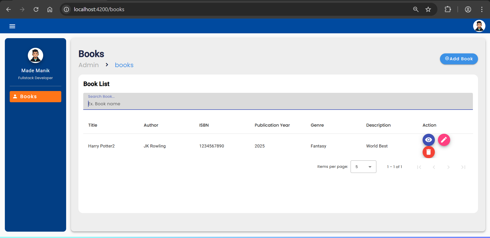

### Overview
    
### Prerequisite

1. Check ng version
   ```
   ng version
   Angular CLI: 15.2.5
   ```
2. Check node version
   ```
   node -v
   v18.10.0
   ```
3. Check npm version
   ```
   npm -v
   8.19.2
   ```
4. Java version (Java 17 or above is required)

### Installation Steps

1. Clone this repo
   ```
   git clone https://github.com/mademanik/book-manager-hubexo.git
   ```

#### Running Springboot Backend Server
2. cd into book-manager-backend
   ```
   cd book-manager-backend
   ```
3. run command below
   ```
   mvnw.cmd spring-boot:run
   ```
4. running server done

#### Running Angular Frontend Client
5. run ng version to check if angular cli@15.2.5 has installed or not
   ```
   ng version
   ```
6. if angular cli not installed, then running below command to install
   ```
   npm install -g @angular/cli@15.2.5
   ```
7. cd into book-manager-frontend
   ```
   cd book-manager-frontend
   ```
8. run npm install or yarn to download package dependency
   ```
   npm i
   ```
9. run npm start to run angular client frontend
   ```
   npm start
   ```
10. open to port http://localhost:4200 on browser to open angular web page
11. running client done

### Azure App Service Deployment Steps

1. Create Azure Container Registry (ACR) used to store backend Docker image
2. Build & Tag Docker Image
```
docker build -t book-manager-backend .
docker tag book-manager-backend acrname.azurecr.io/book-manager-backend:latest
```
3. Push Image to ACR
```
docker push acrname.azurecr.io/book-manager-backend:latest
```
4. Create Azure App Service (Linux, Container-based)
5. Configure App Service
```
Image: acrname.azurecr.io/book-manager-backend:latest
Port: 8080
```
6. Set Environment Variables
```
SPRING_PROFILES_ACTIVE=prod
```
7. Azure pull the image and runs the container

### Architecture Diagram (ASCII)
	       ┌─────────────────────┐
           │   Client / Browser  │
           └──────────┬──────────┘
                      │
           ┌──────────▼──────────┐
           │  Cloud Load Balancer│
           └──────────┬──────────┘
                      │
           ┌──────────▼──────────┐
           │  App Service        │
           │  (Docker Container) │
           │  Spring Boot API    │
           └──────────┬──────────┘
                      │
           ┌──────────▼──────────┐
           │     H2 Database     │
           │   (In-memory DB)    │
           └─────────────────────┘
The application is deployed as a Docker container running a Spring Boot backend on a managed cloud service.
Incoming requests are routed through a cloud load balancer to the containerized application.
The backend uses an in-memory H2 database for simplicity.
This setup allows easy scaling, isolation, and simplified deployment using container images.

### Assumptions / Design Decisions

1. The DevOps setup focuses only on the backend as required.
2. The backend is containerized using Docker for consistent deployment.
3. Unit tests are executed in the CI pipeline, while tests are skipped during Docker image creation to optimize build time.
4. A multi-stage Docker build is used to reduce image size.
5. Deployment targets Azure App Service using container images.
6. An in-memory H2 database is used for simplicity and demonstration purposes.

### Trade-offs / Future Improvements
1. H2 is used for simplicity and can be replaced with a managed database for production.
2. The CI/CD pipeline is minimal and can be extended with automated deployment and rollback.
3. Security and monitoring can be improved for production readiness